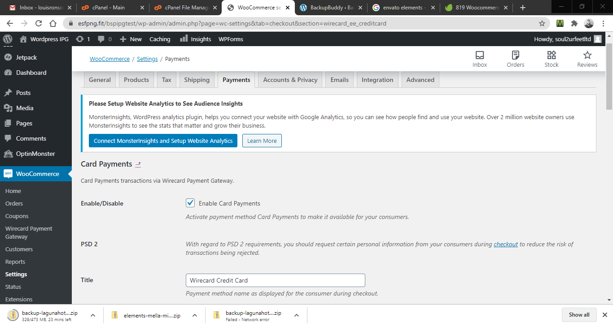
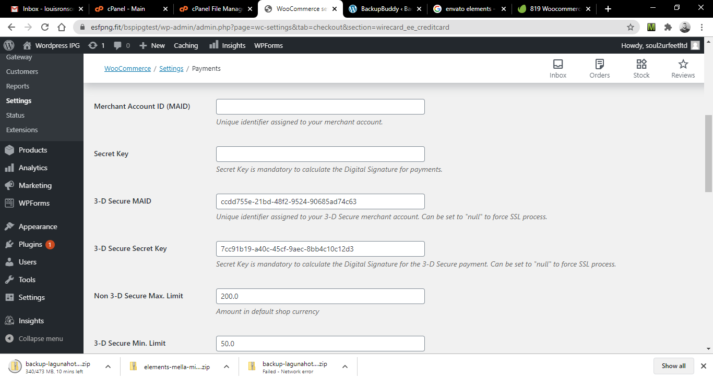
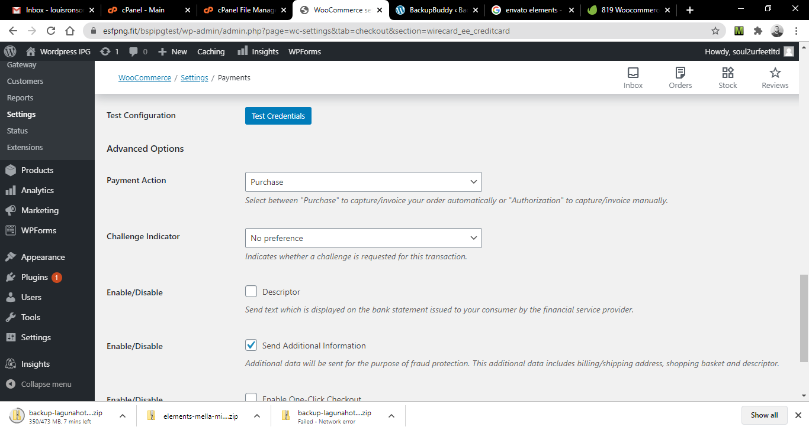
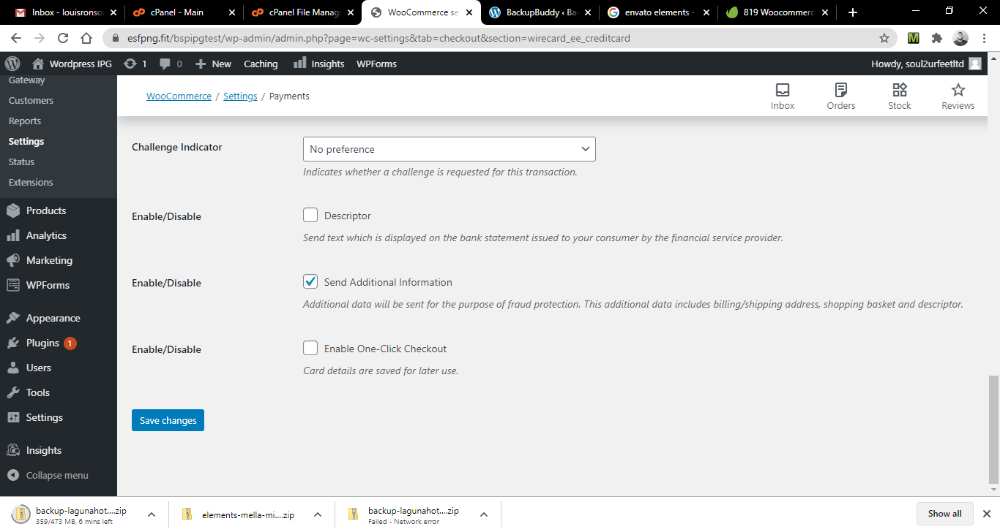

# BSP IPG Integration
I thought it best to document a few things regarding the Internet Payment Gateway (IPG) Integration with Bank South Pacific just for future reference. This does not aim to be a formal documentation, but just a collection of my thoughts on the subject.

## First Contact
My first contact with BSP's was when working with Be Pacific Digital Agency, on a particular website project for *East Street Fitness*. We were under the leadership of Belinda Manning (A top executive of Bank South Pacific) which made it very easy to liase with her BSP team regarding any integration assistance. That particular project gave me the exposure to the documentation, and the whole nature of building e-commerce platforms. As I write this, PNG is in its infancy of the roll-out of IPG solutions for businesses especially in the MSME market. In this first contact of the IPG, I gained a fair understanding of all the pieces and how they play together.

## Integration with Websites
### Challenges Websites built from scratch
#### Introduction
The original *East Street Fitness* website was build from scratch. A colleague of mine, Issac Sailas, was hired onto the team to assist with IPG integration into projects of that nature. We managed to get things going, and created a class called *paymentapi.php* that encapsulated all the logic. This meant that from client to client, we could reuse this payment class and just change the credentials, secret keys, etc. to match each client respectively. The class had a method such as *makePayment(amount)* which you can then pass the amount for purchase.
#### Challenges
- Lots of coding involved, especially if we were to fully customize the IPG component to seamlessely fit into our site's template, theme, style, etc.
- Documentation was vast, and looking for something was sometimes a needle in a haystack.

### Websites built with CMS (WordPress)
#### Introduction
Websites built with WordPress was intially a challenge for me to integrate. However, it turned out the solution to the problem was very simple. 

#### Challenges
- BSP didn't really give much information about versioning etc., so I felt I was left in the dark a little to make assumptions. My main assumption was that BSP supported the WireCard Payment Page (WPP) version 2. When WordPress was installed and all the products was added to the store online, I made sure the latest WooCommerce plugin and Wirecard WooCommerce extension was installed. However, this did not work and the reason was that BSP didn't actually support WPPv2 as yet which was by default what the latest WooCommerce plugin and Wirecard extension used. Solution: I had to revert to an older Wirecard Woocommerce extension that supported WPPv1 and thus, made the change to Wirecard Woocommerce extension v1.6.6.

#### Configuration in WordPress
This is how the configuration for the Wirecard WooCommerce extension looks like under the Payment tab of the WooCommerce settings page:

